# W4A16-инференс LLM на Triton

Int4-квантизация весов и запуск квантизованной Llama-модели

---

## Цель проекта

- Сжать веса линейных слоев LLM до `int4`
- Оставить активации в `bf16`
- Реализовать fused dequantization + matmul на Triton
- Проверить качество и скорость на Llama-3.2-1B

---

## Что реализовано

- `bf16/fp16 -> int4` groupwise quantization
- Упаковка двух `int4` в один `uint8`
- Triton W4A16 matmul kernel
- `QuantLinearW4A16` вместо `nn.Linear`
- Benchmarks kernels и полной модели
- CUDA-тесты корректности

---

## Схема W4A16

```text
W_bf16 -> groupwise int4 + scales
X_bf16 @ W_int4^T -> dequant inside Triton matmul -> Y_bf16
```

- `group_size = 64 / 128 / 256`
- scales хранятся в `bf16`
- `lm_head` в полной модели не квантизуется

---

## Экспериментальный Setup

- GPU: NVIDIA A40
- CUDA: 12.8
- PyTorch: 2.11.0+cu128
- Triton: 3.6.0
- Model: `unsloth/Llama-3.2-1B-Instruct`
- Dataset: WikiText-2

---

## Экономия Памяти Весов

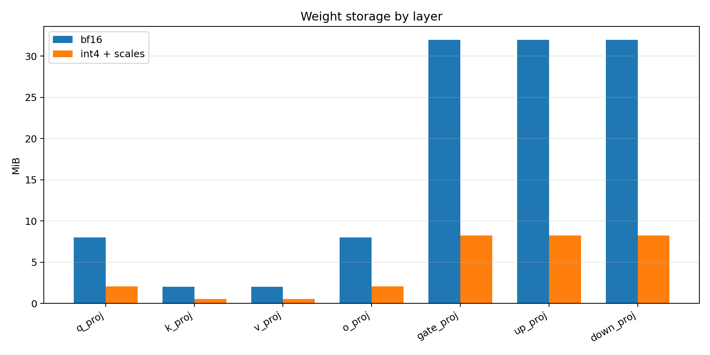

**Итог:** `3.88x` compression при `group_size=128`

---

## Latency: M = 128

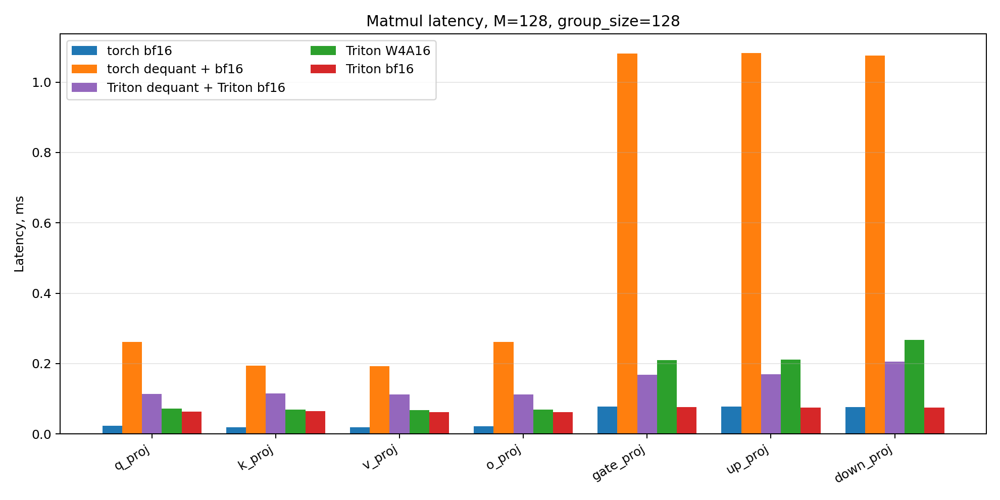

---

## Latency: M = 512

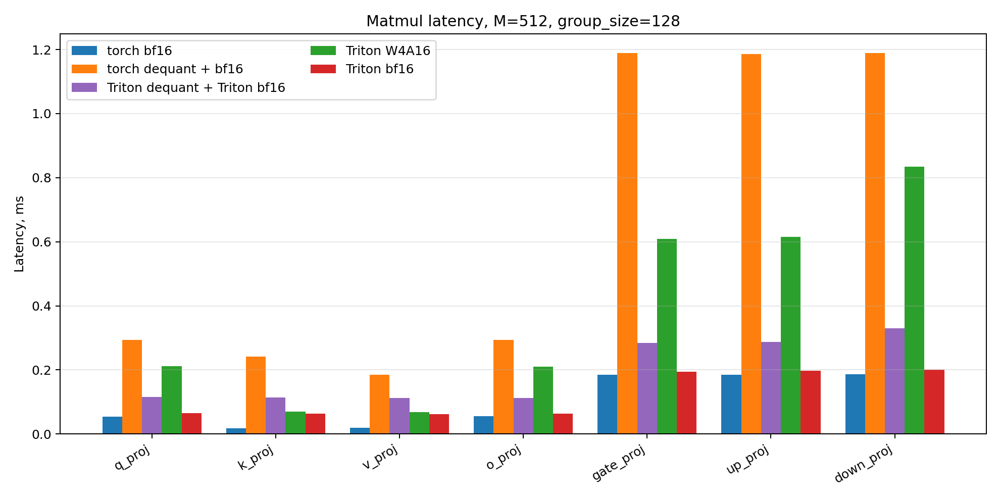

---

## Latency: M = 2048

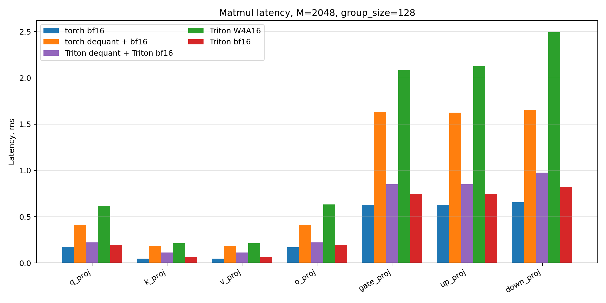

---

## W4A16 vs Torch BF16

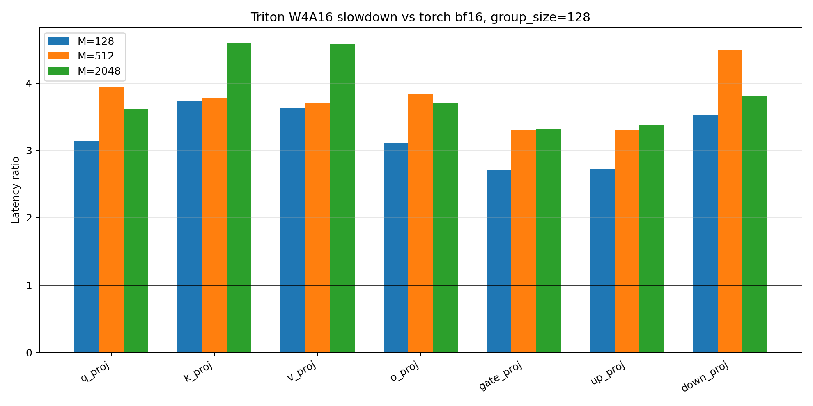

**Итог:** текущий W4A16 kernel медленнее `torch_bf16_linear` примерно в `3.2x-3.9x`

---

## W4A16 vs Triton BF16

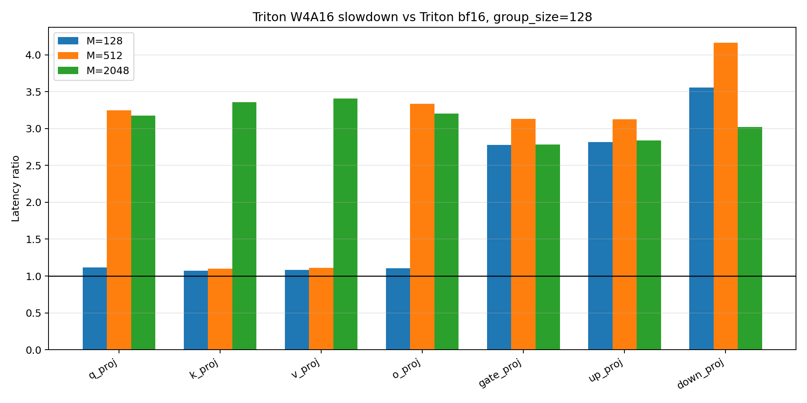

**Итог:** overhead распаковки `int4` и применения scales пока слишком большой

---

## W4A16 vs Separate Triton Dequant

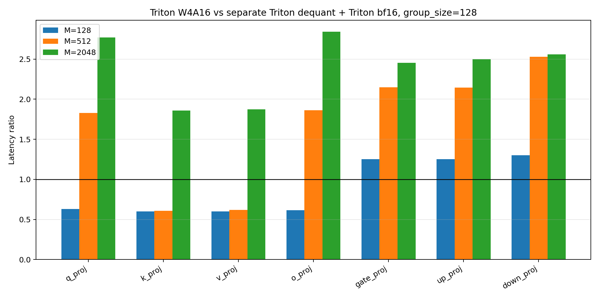

**Итог:** fused kernel быстрее separate dequant только при `M=128`

---

## Подбор Group Size

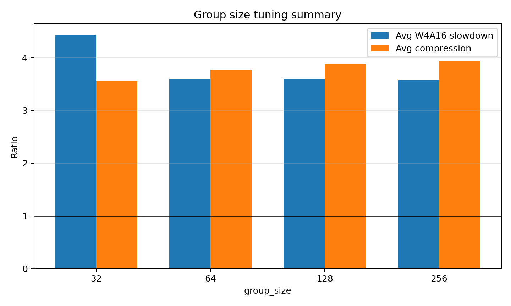

**Итог:** `group_size=64` лучше для качества, `128/256` лучше для memory compression

---

## Full Model: Perplexity, GS=128

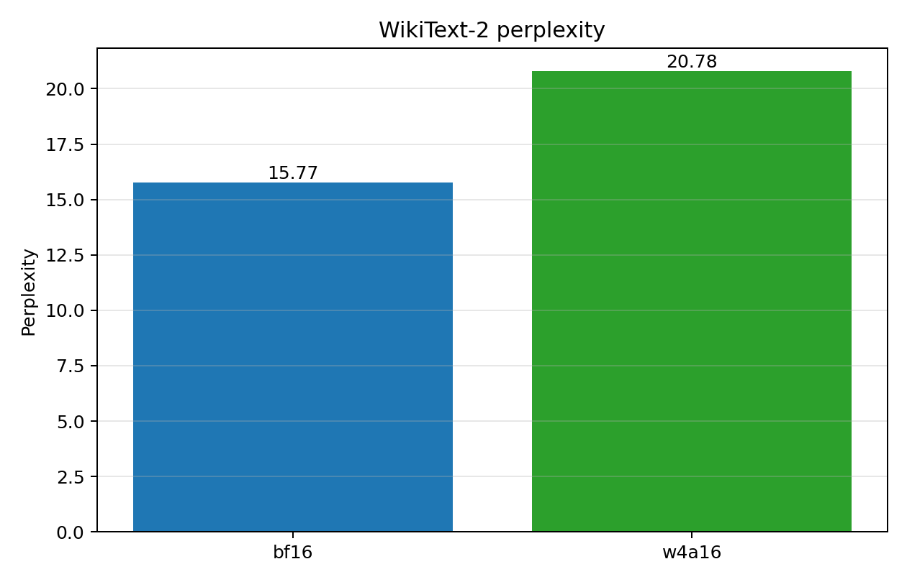

- `bf16`: `15.77`
- `w4a16`: `20.78`
- рост perplexity: `+31.8%`

---

## Full Model: Throughput, GS=128


- forward: `2.33x` медленнее
- generation: `1.58x` медленнее

---

## Full Model: Perplexity, GS=64

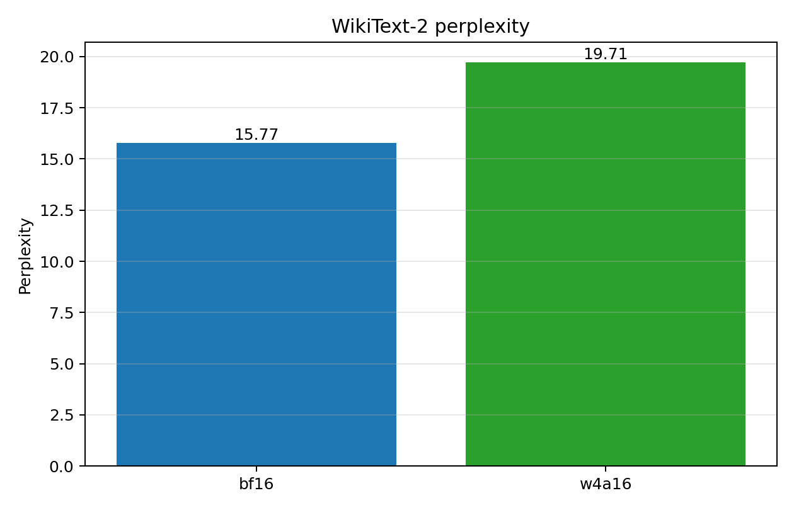

- `bf16`: `15.77`
- `w4a16 gs64`: `19.71`
- `w4a16 gs128`: `20.78`

---

## Full Model: Throughput, GS=64

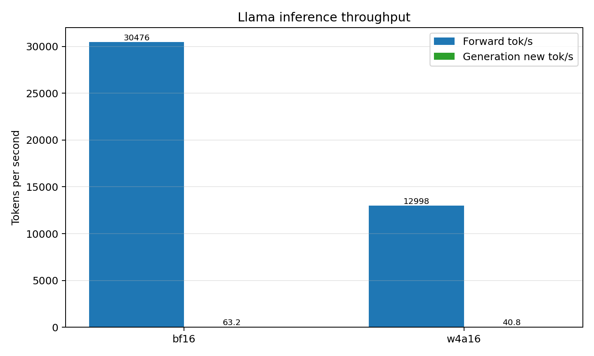

**Итог:** `group_size=64` улучшает качество почти без потери скорости

---

## Проверка Корректности

- `w4a16 fused`, gs128: perplexity `21.81`
- dense dequant reference, gs128: perplexity `21.82`

**Вывод:** просадка качества не из-за Triton kernel, а из-за схемы PTQ-квантизации

---

## Тесты

```bash
CUDA_VISIBLE_DEVICES=0 .venv/bin/python -m pytest tests/test_kernels_and_layers.py -q
```

Проверено:

- W4A16 kernel vs reference
- `QuantLinearW4A16`
- Triton `bf16` matmul
- рекурсивная замена `nn.Linear`
- skip `lm_head`

---

## Главные Выводы

- Весовая память уменьшается до `3.76x-3.88x`
- `group_size=64` дает лучший quality/performance trade-off
- Корректность kernels подтверждена тестами
- Текущий fused W4A16 kernel пока не быстрее `bf16`
- Главная зона развития: оптимизация Triton matmul kernel
